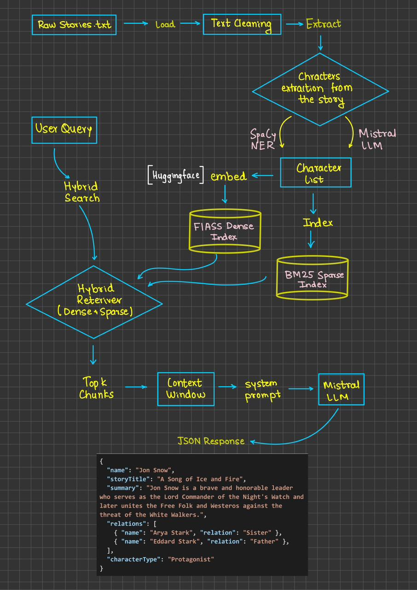

# Story RAG Engine

A Retrieval-Augmented Generation (RAG) system for extracting and querying character information from literary stories. This project uses hybrid retrieval (FAISS + BM25) combined with Mistral AI to provide detailed character information including relationships and summaries.

## Architecture



## Features

- **Hybrid Retrieval**: Combines dense vector search (FAISS) with sparse keyword search (BM25) for better accuracy
- **Character Extraction**: Automatically identifies characters from stories using SpaCy NER and Mistral AI
- **Relationship Mapping**: Extracts and infers character relationships from story context
- **Smart Alias Detection**: Handles character name variations and aliases automatically
- **Story-Based Filtering**: Filters results by story title for contextual accuracy

## Prerequisites

- **Python 3.11** (required)
- **Git** (for cloning the repository)
- **Mistral AI API Key** ([Get one here](https://console.mistral.ai/))

## Setup Instructions

### 1. Clone the Repository

```bash
git clone <your-repo-url>
cd DeepStack_AI_Assignment
```

### 2. Set Up Environment Variables

Create a `.env` file in the project root directory:

Add your Mistral AI API key to the `.env` file:

```env
MISTRAL_API_KEY=your_mistral_api_key_here
```

**Important**: Never commit the `.env` file to version control. It's already included in `.gitignore`.

### 3. Prepare the Data Directory

The project expects text files in a `data/` directory. If you don't have one yet:

```bash
# Create data directory (if it doesn't exist)
mkdir data
```

Place your story text files (`.txt` format) in the `data/` directory. The project already includes sample stories:
- `a-mother.txt`
- `sorrow.txt`
- `the-lantern-keepers.txt`
- `the-poor-relations-story.txt`
- `the-schoolmistress.txt`

### 4. Create Virtual Environment

Create a virtual environment using Python 3.11:

```bash
# Windows (PowerShell)
py -3.11 -m venv .venv

# Windows (Command Prompt)
python3.11 -m venv .venv

# Linux/Mac
python3.11 -m venv .venv
```

### 5. Activate Virtual Environment

**Windows (PowerShell):**
```powershell
.\.venv\Scripts\Activate
```

**Windows (Command Prompt):**
```cmd
.venv\Scripts\activate.bat
```

**Linux/Mac:**
```bash
source .venv/bin/activate
```

You should see `(.venv)` in your terminal prompt indicating the virtual environment is active.

### 6. Install Dependencies

Install all required packages from `requirements.txt`:

```bash
pip install --upgrade pip
pip install -r requirements.txt
```

**Note**: Installation may take several minutes (3-5 minutes) due to large dependencies like:
- `sentence-transformers` (downloads ML models ~100MB+)
- `faiss-cpu` (may compile from source)
- `spacy` (requires additional language model download)

If you want to see progress during installation:
```bash
pip install -r requirements.txt -v --progress-bar on
```

### 7. Download SpaCy Language Model

After installation, download the required SpaCy language model:

```bash
python -m spacy download en_core_web_sm
```

This is typically handled automatically when you run the ingestion script, but you can download it manually to avoid delays.

## Usage

## Alternative 

Just in case you face issues with the files the raw Jupyter Notebook having the complete pipeline is also given you can refer to this notebook to see the step by step implementation process.

```raw_notebook.ipynb
```

### Command 1: Compute Embeddings (Ingest Stories)

First, process all stories in the `data/` directory to create the vector database and character map:

```bash
python main.py compute-embeddings
```

**What this does:**
- Loads all `.txt` files from the `data/` directory
- Extracts characters from each story
- Creates character map (`story_characters.json`)
- Generates FAISS vector embeddings
- Creates BM25 sparse index
- Saves indexes to disk

**Example Output:**
```
🚀 Starting Ingestion Process...
📂 Loading documents...
🕵️  Extracting characters for 5 stories...
   -> A Mother: Found 15 characters.
   -> Sorrow: Found 8 characters.
   ...
💾 Saving character map to story_characters.json...
✂️  Splitting and enriching chunks...
🧠 Creating Vector Index (FAISS)...
🔤 Creating BM25 Index...
✅ Ingestion Complete! Database ready.
```

### Command 2: Get Character Information

Query information about a specific character:

```bash
python main.py get-character-info "Character Name"
```

**Examples:**

```bash
# Query a character from "a-mother"
python main.py get-character-info "Mrs Kearney"

# Query a character from "sorrow"
python main.py get-character-info "Grigory Petrov"

# With verbose output (shows raw LLM response)
python main.py get-character-info "Kathleen Kearney" --verbose
```

**Example Output:**
```json
{
    "name": "Mrs Kearney",
    "storyTitle": "A Mother",
    "summary": "Mrs Kearney is a determined mother who organizes her daughter's musical career...",
    "relations": [
        {
            "name": "Kathleen Kearney",
            "relation": "Daughter"
        },
        {
            "name": "Mr Holohan",
            "relation": "Business Associate"
        }
    ],
    "characterType": "Protagonist"
}
```
## How It Works

1. **Ingestion Phase** (`compute-embeddings`):
   - Loads text files from `data/` directory
   - Uses SpaCy NER and Mistral AI to extract character names
   - Splits stories into chunks with metadata
   - Creates hybrid search indexes (FAISS + BM25)
   - Generates a character map linking characters to stories

2. **Retrieval Phase** (`get-character-info`):
   - Searches for character using hybrid retrieval
   - Detects aliases and canonical names
   - Filters context by story title
   - Uses Mistral AI to generate structured JSON response
   - Returns character summary, relationships, and type

## Troubleshooting

### Issue: "MISTRAL_API_KEY not found"
**Solution**: Ensure your `.env` file exists in the project root and contains `MISTRAL_API_KEY=your_key_here`

### Issue: "Character map not found"
**Solution**: Run `python main.py compute-embeddings` first to create the indexes

### Issue: "SpaCy model not found"
**Solution**: Run `python -m spacy download en_core_web_sm` or let the script download it automatically

### Issue: Installation taking too long
**Solution**: This is normal. Large packages like `sentence-transformers` need to download models. Use `-v` flag to see progress.


## Additional Notes

- The first run of `compute-embeddings` will download the HuggingFace embedding model (~90MB)
- Generated indexes are saved locally and reused until you run `compute-embeddings` again
- Add new stories by placing `.txt` files in the `data/` directory and re-running `compute-embeddings`
- The system handles character name variations and aliases automatically

